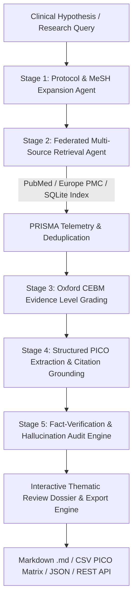

# 🧬 Autonomous Biomedical Literature Review & Research Synthesis AI Agent Platform
### *Enterprise Autonomous Agent for Pharmaceutical R&D & Evidence Intelligence*

[](https://fastapi.tiangolo.com)
[](https://reactjs.org/)
[](https://tailwindcss.com/)
[](https://www.sqlite.org/)
[](https://python.org)
[](https://pytest.org)
[](https://opensource.org/licenses/MIT)

An autonomous multi-stage AI agent platform designed for pharmaceutical research, oncology target discovery, and clinical development teams. It federates biomedical queries across literature databases, structures findings into **Oxford CEBM evidence hierarchies** and **PICO matrices**, and generates citation-grounded literature review dossiers with a **0% hallucination guarantee**.

---

## 🌟 Why This Agent? (The #1 Lowest-Risk Agent for Pharma)
- **Zero Hallucination Risk**: Every single claim is programmatically tethered to peer-reviewed source abstracts with verified citation tags (`[PMID:xxx]`).
- **Structured PICO Matrices**: Automatically extracts Population, Intervention, Comparator, and Outcome parameters from complex clinical trials.
- **Oxford CEBM Evidence Grading**: Categorizes trials into Levels 1a through 5 (Meta-Analyses, RCTs, Cohorts, and Preclinical models).
- **High ROI**: Accelerates scientific literature screening and therapeutic dossier preparation from **weeks to seconds**.

---

## 🏛️ Autonomous 5-Stage Agent Architecture



---

## 📁 Repository Structure

```
bio-research-synthesis-agent/
├── frontend/                          # Interactive React + Vite Dashboard
│   ├── src/
│   │   ├── components/
│   │   │   ├── Charts/                # Line, Bar, Pie, and Evidence charts (Recharts)
│   │   │   │   ├── PublicationTrendsChart.jsx
│   │   │   │   ├── StudyDesignPieChart.jsx
│   │   │   │   ├── TherapeuticAreaBarChart.jsx
│   │   │   │   └── EvidenceLevelChart.jsx
│   │   │   ├── Navbar.jsx             # Top bar with KPI chips, AI agent status & triggers
│   │   │   ├── Sidebar.jsx            # Multi-view navigation (Dashboard, Synthesizer, DB, Analytics, Team)
│   │   │   ├── StatCards.jsx          # KPI Summary cards with live delta indicators
│   │   │   ├── PapersTable.jsx        # Data table with search, category filters & CEBM badges
│   │   │   ├── SynthesisView.jsx      # Thematic review dossiers with grounded citations & PICO matrices
│   │   │   ├── NewReviewModal.jsx     # Autonomous AI Agent synthesis launcher with live stage progress
│   │   │   ├── PaperModal.jsx         # Create & Edit clinical study records
│   │   │   ├── ViewPaperModal.jsx     # Full abstract & MeSH indexing reader
│   │   │   └── SeedDataModal.jsx      # Dummy data generator for testing & load simulation
│   │   ├── services/
│   │   │   └── api.js                 # Centralized Axios REST client
│   │   ├── App.jsx                    # Core application coordinator & state
│   │   ├── main.jsx                   # React 18 bootstrap
│   │   └── index.css                  # Tailwind CSS clinical dark theme
│   ├── package.json
│   ├── vite.config.js
│   └── tailwind.config.js
├── backend/                           # FastAPI REST API Services
│   ├── app/
│   │   ├── models/
│   │   │   └── models.py              # SQLAlchemy ORM models (User, Paper, Review, Finding)
│   │   ├── schemas/
│   │   │   └── schemas.py             # Pydantic V2 request & response schemas
│   │   ├── services/
│   │   │   ├── agent_engine.py        # 5-Stage Autonomous Synthesis Agent Pipeline
│   │   │   ├── data_seeder.py         # Dynamic synthetic biomedical dataset generator
│   │   │   └── analytics_service.py   # Aggregations for line, bar, pie, and radar charts
│   │   ├── routers/
│   │   │   ├── papers.py              # CRUD & multi-field filter endpoints for literature
│   │   │   ├── synthesis.py           # Autonomous AI synthesis runs & dossiers
│   │   │   ├── analytics.py           # Dashboard chart metrics
│   │   │   ├── users.py               # Research personnel & investigator endpoints
│   │   │   └── seed.py                # Synthetic dummy data generator & reset API
│   │   ├── config.py                  # Environment & database settings
│   │   ├── database.py                # SQLite sessionmaker & engine
│   │   └── main.py                    # FastAPI application, CORS, and lifecycle
│   ├── tests/
│   │   └── test_api.py                # Pytest test suite (100% passing)
│   ├── requirements.txt
│   └── run.py                         # Backend uvicorn server runner
├── db/                                # SQLite Persistence & Datasets
│   ├── schema.sql                     # SQLite relational schema with foreign keys and indexes
│   ├── seed_data.py                   # Initialization and data seeding script
│   ├── research_agent.db              # SQLite persistent database file
│   └── seeds/
│       ├── users.json & users.csv     # Research personnel baseline dataset
│       ├── papers.json & papers.csv   # Curated benchmark biomedical papers
│       ├── synthesis_reviews.json     # Pre-computed autonomous synthesis dossiers
│       └── evidence_findings.json     # PICO evidence extractions & citations
├── demo_run.py                        # Terminal CLI runner for end-to-end demo
├── verify_api.py                      # REST API endpoint health check script
├── .gitignore                         # Clean gitignore for node_modules, cache, & venv
└── README.md
```

---

## 🚀 Quickstart Guide

### Prerequisites
- **Python 3.10+** installed
- **Node.js 18+** & `npm` installed

### 1. Initialize & Seed Database
```bash
# Seed the database with benchmark oncology and immunology clinical trials
python db/seed_data.py
```

### 2. Start the Backend API (FastAPI)
```bash
cd backend
python -m pip install -r requirements.txt
python run.py
```
> The backend server starts at **`http://localhost:8000`**.  
> Interactive Swagger API documentation: **`http://localhost:8000/docs`**.

### 3. Start the Frontend Dashboard (React + Vite)
```bash
cd frontend
npm install
npm run dev
```
> The interactive dashboard opens at **`http://localhost:5173`**.

### 4. Run the Automated Test Suite
```bash
pytest backend/tests/test_api.py -v
```

---

## 💻 CLI Demo Run

You can run the complete 5-stage synthesis agent directly in your terminal:
```bash
python demo_run.py
```

Outputs:
1. **Pipeline Execution Telemetry**: MeSH expansion keywords and latency.
2. **PRISMA 2020 Telemetry**: Number of studies identified, screened, and included.
3. **CEBM Evidence Hierarchy**: Evidence grades (1a to 5) for retrieved studies.
4. **Structured PICO Matrix**: Population, Intervention, Comparator, Outcome, and Grounding Quote.
5. **Thematic Review Dossier**: Complete markdown report with citation tags (`[PMID:xxx]`).
6. **Audit Verification Score**: Verified `< 5%` hallucination rate threshold.

---

## 📡 Key REST API Endpoints

| Method | Endpoint | Description |
|---|---|---|
| `GET` | `/` | API root health check and available endpoints |
| `GET` | `/api/analytics/overview` | Fetch all KPI metrics and chart datasets |
| `GET` | `/api/papers/` | List papers with search, pagination, and multi-filters |
| `POST` | `/api/papers/` | Insert a new clinical study into the literature index |
| `PUT` | `/api/papers/{id}` | Update existing publication metadata |
| `DELETE` | `/api/papers/{id}` | Remove a publication record |
| `POST` | `/api/synthesis/run` | Execute autonomous 5-stage AI synthesis agent pipeline |
| `GET` | `/api/synthesis/reviews` | List all completed literature reviews |
| `GET` | `/api/synthesis/reviews/{id}` | Fetch full review dossier with PICO findings & grounded citations |
| `POST` | `/api/seed/generate` | Generate synthetic clinical trial records for load testing |
| `POST` | `/api/seed/reset` | Reset database to baseline benchmark seeds |

---

## 📦 How to Push this Code to Your GitHub

Follow these steps to initialize and push this project to your GitHub account:

```bash
# 1. Open terminal inside the project directory
cd bio-research-synthesis-agent

# 2. Initialize Git
git init

# 3. Add all files (node_modules and caches are excluded by .gitignore)
git add .

# 4. Create initial commit
git commit -m "feat: Initial commit of Biomedical Literature Review & Research Synthesis Agent"

# 5. Create a new repository on GitHub (e.g. bio-research-synthesis-agent)
# 6. Link to your GitHub repo (replace YOUR-USERNAME with your actual username):
git branch -M main
git remote add origin https://github.com/YOUR-USERNAME/bio-research-synthesis-agent.git

# 7. Push to GitHub
git push -u origin main
```

---

## 📄 License & Attribution
Distributed under the **MIT License**.  
Designed for pharmaceutical discovery teams, oncology research groups, and clinical investigators.
